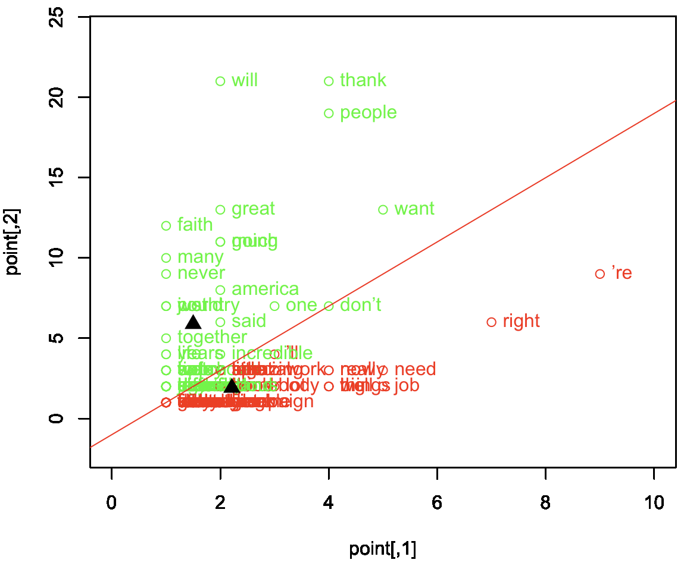

# text-mining-analysis
# Cluster analysis with R

Original repository https://github.com/modulus100/text-mining-analysis
This project is intended for learning a fundamentals of machine learning and data mining
algorithms. All the code is written using a pure R programming language. 
The project contains an implementation of the following algorithms. I provided information
 source references in the code as well, there are commented urls. In general, in this project I compare
  two text files for performing text analysis, these two files are located in the samples folder.

* Cosine distance
* k-means algorithm
* decision boundary algorithm

**samples** contains two text files which are used for the text analysis.
Please specify your path for **samples** in
**main.R** before you run the project.

```
cname <- file.path("yourLocalPathToProject/samples")
```

**Distances**  
Cosine distance is a good choice whenever a distance must be calculated in a high dimension environment.
```
distance <- cosineDistance(dataSet[1,], dataSet[2,]))
```

**Kmeans, x - matrix with the data, k - number of clusters, 
distance method - name of a distance method ( Cosine is default)**
```
kmData <- kmeans2(dataSet, k)
plotKMeans(kmData)
```

### kMeans example using Cosine distance, centroids are solid triangles


### Functions overview

**computeNewCentroids** - recalculates and returns new centroids whithin each iteration during 
 the kmeans computing
 
 **plotKMeans** - plots all the data point by point
 
 **initialTextProcessing** - preprocessing function which helps to work with a clean text data
 
 **main.R** - the main file where the analysis begins
 
 **decisionBoundary.R** is intended for decision boundary part, analysis and plot

### Used information

https://www.youtube.com/watch?v=4HKqjENq9OU  
https://stackoverflow.com/questions/38173136/euclidean-distance-for-three-or-more-vectors  
https://stackoverflow.com/questions/30195806/k-means-stopping-criteria-in-matlab  
https://nlp.stanford.edu/IR-book/html/htmledition/k-means-1.html  
https://kevinzakka.github.io/2016/07/13/k-nearest-neighbor/  
https://habr.com/post/199060/  
https://habr.com/post/101338/  
https://www.coursera.org/lecture/cluster-analysis/6-2-clustering-evaluation-measuring-clustering-quality-RJJfM  

